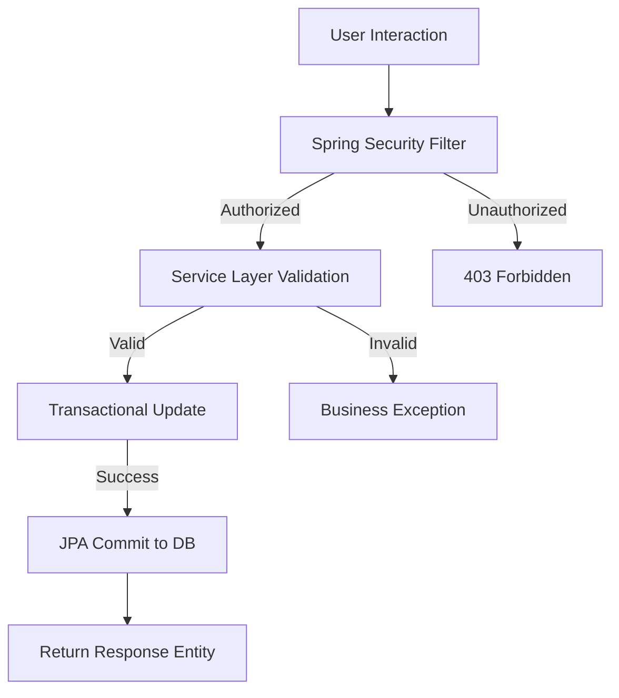

# 📱 Social-Net - API REST com Java & Spring Boot (BACK-END)

This project demonstrates the implementation of a scalable social media infrastructure using Java and the Spring Ecosystem. The primary objective is to manage complex data relationships and ensure secure, high-performance interactions between users.

---

## 🛠️ Tech Stack & Tools

* **Backend Core:** Java & Spring Boot
* **Security & Data:** Spring Security & Bean Validation (JSR 380)
* **Persistence & Databases:** Spring Data JPA (PostgreSQL) & Spring Data MongoDB
* **API Testing & Environment:** Postman & VS Code

---

## 🎯 Computational Features

### 1. Social Graph & Relationships
* **Self-Referencing Logic:** Implementation of follower/following dynamics using self-referencing entities.
* **Complex Cardinality:** Robust handling of `ManyToMany` and `OneToMany` relationships for posts, likes, and comments.
* **Integrity:** Automated cascading and orphan removal to maintain database health.

### 2. Security & Data Validation
* **Spring Security:** Centralized authentication and authorization layers.
* **Input Sanitization:** Use of Bean Validation (JSR 380) to enforce data constraints and prevent malformed persistence.
* **State Management:** Strict control over entity states via Hibernate/JPA to avoid side effects in concurrent environments.

### 3. Architecture
* **Layered Design:** Clear separation of concerns between Controllers, Services, and Repositories.
* **Persistence:** Optimized SQL generation through Spring Data JPA for PostgreSQL.

## 📐 Database Architecture

The system leverages PostgreSQL to enforce social constraints directly at the engine level:

```sql
CREATE TABLE users (
    id SERIAL PRIMARY KEY,
    username VARCHAR(50) UNIQUE NOT NULL,
    email VARCHAR(100) UNIQUE NOT NULL,
    bio TEXT,
    created_at TIMESTAMP DEFAULT CURRENT_TIMESTAMP
);

CREATE TABLE followers (
    follower_id INT REFERENCES users(id) ON DELETE CASCADE,
    following_id INT REFERENCES users(id) ON DELETE CASCADE,
    PRIMARY KEY (follower_id, following_id)
);
```
---

## 💻 System Logical Flow

The diagram below illustrates the backend behavior when a user interacts with a post:



---

## 🚀 How to Run the Project

### 1. Clone the Repository
```bash
git clone github.com
cd Social-Net
```

### 2. Configure the Database
Access the `src/main/resources/application.properties` file and insert your local PostgreSQL credentials:

```properties
spring.datasource.url=jdbc:postgresql://localhost:5432/your_database
spring.datasource.username=your_username
spring.datasource.password=your_password
spring.jpa.hibernate.ddl-auto=update
```

### 3. Compile and Run
Run the application using Maven:
```bash
mvn spring-boot:run
```

## 🤝 Contributing

Ideas for the evolution of this repository:
* Implementation of JWT (JSON Web Tokens) for stateless authentication.
* Integration with Redis for caching the news feed.
* Asynchronous media processing using Spring Events.

---
Developed with ☕ by [Lucas Silva](https://github.com)
